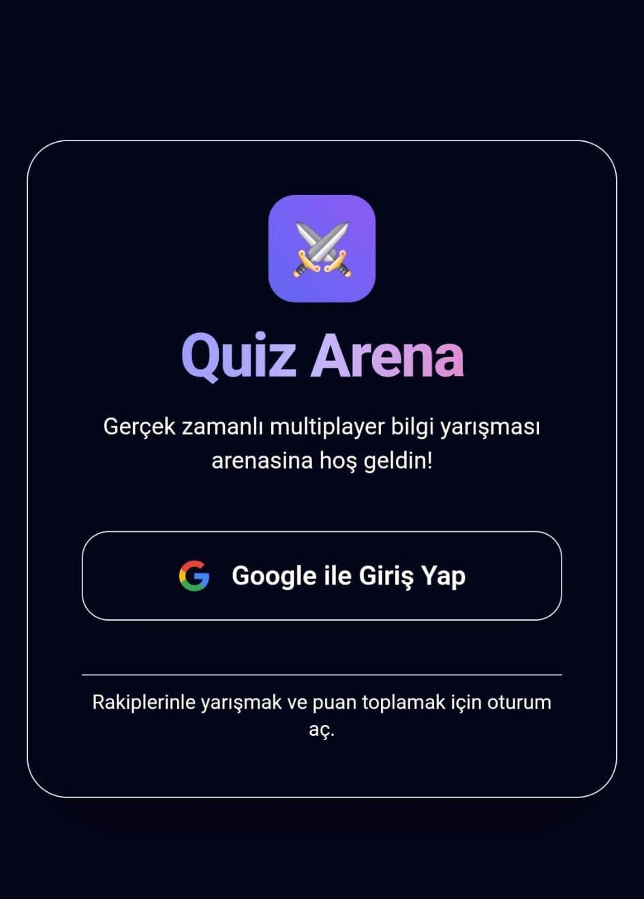
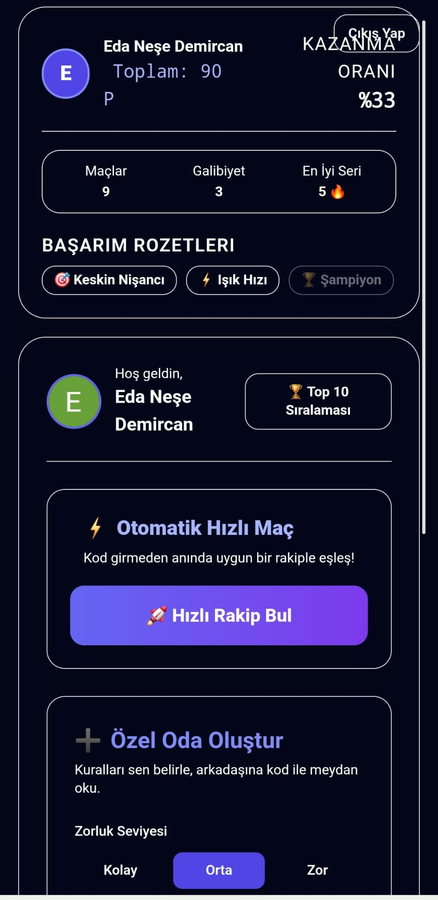
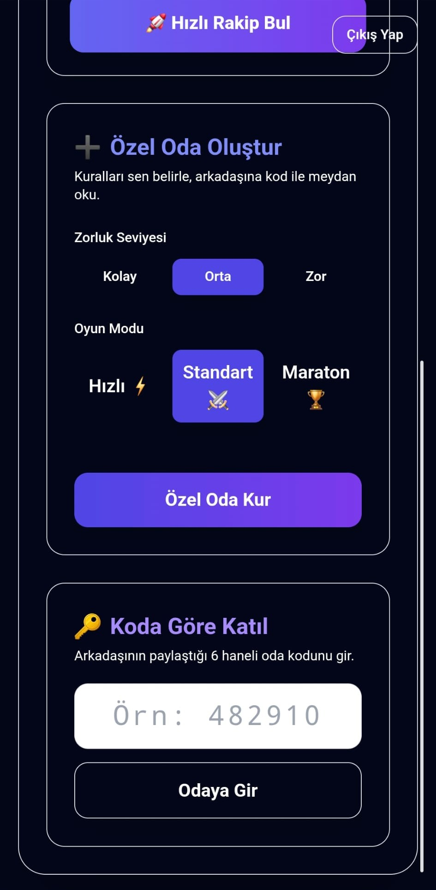
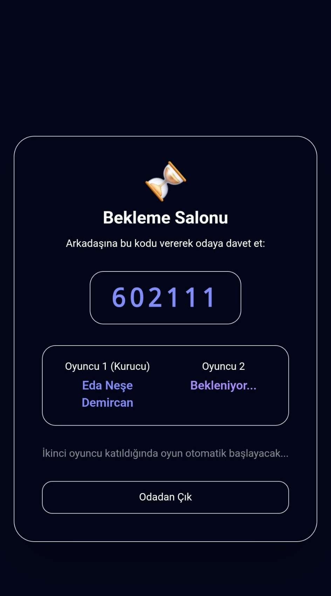
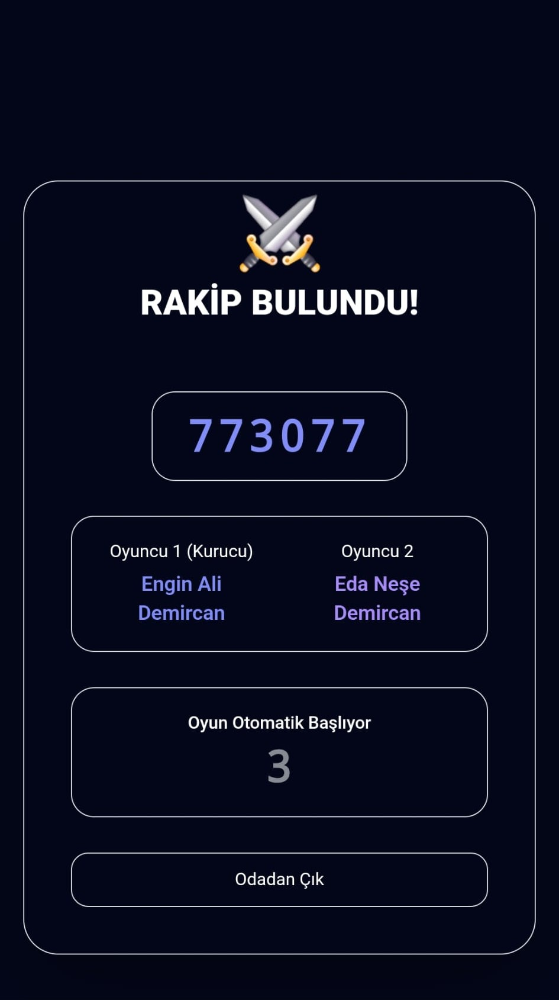
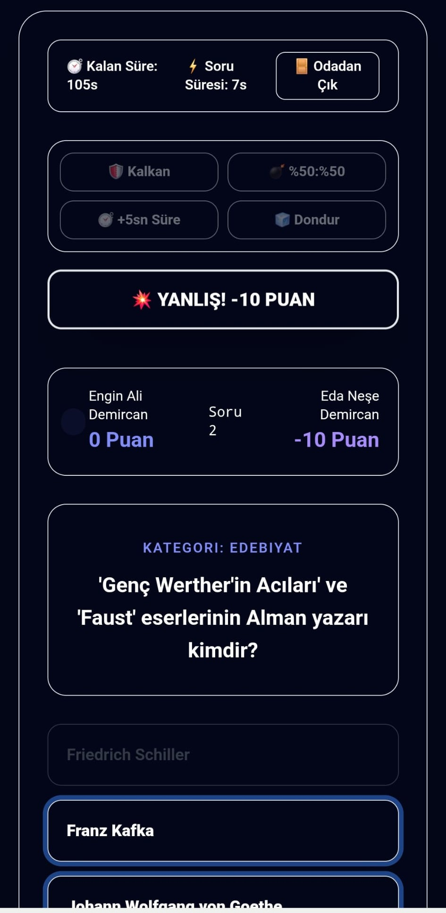
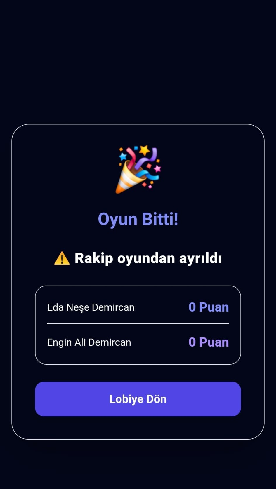

# ⚔️ QUIZ ARENA

> **"Sadece bilmek yetmez; daha hızlı olmalı, rakibini doğru anda kilitlemeli ve arenanın tek şampiyonu sen olmalısın!"**

### 🔥 Sıradan Soru Yarışmalarını Unutun!
**Quiz Arena**, klasik "soruyu oku ve cevapla" mantığının çok ötesinde, **anlık reflekslerin, yüksek hırsın ve stratejik zekanın** çarpıştığı gerçek zamanlı bir multiplayer yarışma arenasıdır. 

Canlı rakiplerle birebir (1v1) yüzleşin, saniyelerle yarışırken **Dondur**, **Kalkan** ve **+5sn Süre** gibi sabotaj jokerleriyle rakibinizin dengesini bozun! Burada sadece bilgi değil; doğru zamanlama, soğukkanlılık ve rekabet hissi kazandırır.

* 🚀 **Sıfır Gecikme, Maksimum Adrenalin:** Firestore Real-time altyapısı sayesinde rakibinizin her hamlesini canlı izleyin.
* ⚡ **Işık Hızında Matchmaking:** Beklemek yok, saniyeler içinde arenaya inip rakibinizle eşleşin.
* 💣 **Sabotaj & Strateji:** Karşı taraf tam soruyu okurken ekranını dondurun, puan kaybetmemek için kalkanınızı devreye sokun ve skor tablosunu altüst edin!

---

## 📱 Ekranlar, Akışlar ve Özellikler

### 1. 🔐 Giriş Ekranı
<p align="left">
  
</p>

* **Google OAuth Entegrasyonu:** Kullanıcılar tek tıkla "Google ile Giriş Yap" butonunu kullanarak güvenli bir şekilde oturum açar.
* **Kişiselleştirilmiş İstatistikler:** Kullanıcının benzersiz kimliği (UID) üzerinden tüm maç geçmişi, puanları ve başarımları Firestore üzerinde güvenle saklanır.

---

### 2. 🏛️ Lobi & Profil Ekranı (Lobi 1)
<p align="left">
  
</p>

* **Performans İstatistikleri:** Toplam Puan, Kazanma Oranı (%), Toplam Maç Sayısı, Galibiyet Sayısı ve En İyi Galibiyet Serisi (🔥) anlık gösterilir.
* **Başarım Rozetleri:** Oyuncunun performansına göre kilitleri açılan *"Keskin Nişancı"*, *"Işık Hızı"* ve *"Şampiyon"* gibi özel başarı rozetleri.
* **🏆 Global Top 10 Sıralaması:** Tüm oyuncular arasından en yüksek puana sahip ilk 10 kişiyi canlı gösteren sıralama paneli modalı.
* **⚡ Otomatik Hızlı Maç:** Kod girmeye gerek kalmadan, akıllı matchmaking algoritması sayesinde "Hızlı Rakip Bul" butonuyla tek tıkla saniyeler içinde rakip bulma.

---

### 3. ⚙️ Özel Oda Kurma & Katılma (Lobi 2)
<p align="left">
  
</p>

* **➕ Özel Oda Oluşturma:** Arkadaşlarınızla oynamak için kendi kurallarınızı belirleyeceğiniz özel oda oluşturma alanı.
  * **Zorluk Seviyesi:** Kolay, Orta, Zor seçenekleri.
  * **Oyun Modları:** Hızlı (⚡), Standart (⚔️), Maraton (🏆) seçenekleri.
* **🔑 Koda Göre Katıl:** Arkadaşınızın oluşturduğu 6 haneli özel oda kodunu girerek doğrudan odaya dahil olma.

---

### 4. ⏳ Bekleme Salonu
<p align="left">
  
</p>

* **Oda Kurulumu & Davet:** "Hızlı Rakip Bul" veya "Özel Oda Kur" dendiğinde sistem sizi bekleme salonuna atar ve otomatik olarak **6 haneli benzersiz bir oda kodu** üretir.
* **Rakip Aranıyor:** Sistem ikinci oyuncuyu beklerken durumu canlı takip eder. İstediğiniz an "Odadan Çık" butonu ile lobiye dönebilirsiniz.

---

### 5. ⚔️ Rakip Bulundu Ekranı
<p align="left">
  
</p>

* **Anlık Eşleşme:** İkinci oyuncu geldiğinde sistem Kurucu (Oyuncu 1) ile Katılanı (Oyuncu 2) eşleştirir.
* **5 Saniyelik Otomatik Geri Sayım:** *"Rakip Bulundu!"* uyarısıyla birlikte 5 saniyelik geri sayım başlar ve her iki cihazı da eşzamanlı olarak oyun alanına yönlendirir.

---

### 6. 🎮 Oyun Sayfası & Canlı Rekabet
<p align="left">
  
</p>

* **Süre Yönetimi:** Seçilen oyun moduna göre Toplam Oda Süresi ve Soru Başına Süre anlık geriye sayar.
* **Dinamik Puanlama:** Doğru cevaplar puan kazandırırken, yanlış cevaplarda sistem **-10 Puan** düşer.
* **⚔️ Stratejik Jokerler:**
  1. 🛡️ **Kalkan Jokeri:** Yanlış cevap verilse dahi eksi puan almayı engeller.
  2. 💣 **%50 : %50 Jokeri:** Yanlış olan iki şıkkı eleyerek doğru cevaba odaklanmayı sağlar.
  3. ⏱️ **+5sn Süre Jokeri:** Sıkışılan anlarda soru süresine ek süre kazandırır.
  4. 🧊 **Dondur Jokeri (Sabotaj):** Karşı tarafın ekranını kilitler; rakip soruyu okuyup cevaplayamazken oyuncuya rahatça düşünme ve öne geçme fırsatı tanır.
* **Anlık Skor Tablosu:** Her iki oyuncunun skoru, soru numarası ve cevap durumları eşzamanlı güncellenir.
* **Odadan Çık Butonu:** İstendiği an maçtan çekilme imkanı sunar.

---

### 7. 🚪 Odadan Ayrılma & Anlık Bildirim
<p align="left">
  
</p>

* **Erken Ayrılma Tespiti:** Oyunculardan biri yarışma esnasında "Odadan Çık" butonuna bastığında veya bağlantısı koptuğunda, Firestore Real-time listener durumu anında tespit eder.
* **Canlı Bildirim:** Diğer oyuncunun ekranında *"⚠️ Rakip oyundan ayrıldı"* uyarısı belirir, maç sonlanır ve oyuncu güvenli bir şekilde lobiye döner.

---

## 🛠️ Kullanılan Teknolojiler

* **Frontend:** React, TypeScript, Vite, Tailwind CSS
* **Backend / Database:** Firebase (Firestore, Auth)
* **Deployment:** Vercel

---

## 💡 Projenin Öne Çıkan Avantajları

* **⚡ Sıfır Gecikmeli Senkronizasyon:** Firestore Real-time altyapısı sayesinde skorlar, dondurma jokerleri ve zaman senkronu milisaniyelik hassasiyetle gerçekleşir.
* **🎯 İki Yönlü Stratejik Derinlik:** Sadece bilgiye değil, jokerlerin doğru zamanda kullanımına dayalı rekabetçi oyun dinamiği.
* **🛡️ Hata Toleranslı Matchmaking:** Kopan bağlantıları tespit edip sistemi kilitlenmekten kurtaran akıllı durum yönetimi.

---

## 🚀 Kurulum (Local Development)

Projeyi kendi bilgisayarınızda çalıştırmak için:

```bash
# 1. Depoyu klonlayın
git clone [https://github.com/edanesedemircan/Quiz-Arena.git](https://github.com/edanesedemircan/Quiz-Arena.git)

# 2. Proje dizinine girin
cd Quiz-Arena

# 3. Bağımlılıkları yükleyin
npm install

# 4. Geliştirici sunucusunu başlatın
npm run dev
